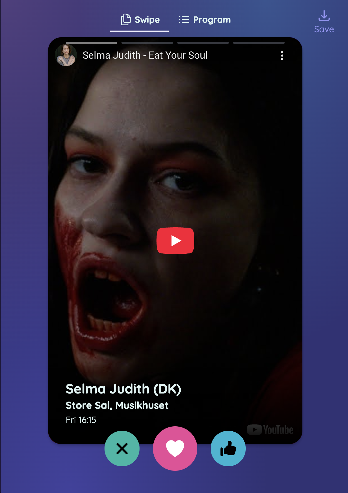

# Oplev

The prototype for experiencing festival programs in a fun and interactive way. Bringing the music program to attendees in an interactive manner gives way for a ton of convenience features along with allowing the ability to explore unknown territories. Currently, the software uses a tinder-approach, which simply replicates the Tinder swiping mechanism with different content. A user can therefor dismiss, like and superlike content.

.

## Vision

On the long run, the platform is intended to be an interactive way to approach a large variety of cultural experiences. This means any event from visiting an aquarium, to experiencing sound therapy, to exploring a music catalogue and more. This way, we have a central hub for exploring what actually gives life to a city and to life itself.

We strive to be the main portal of distributing events and may serve as a commercializing platform for large vendors like Ticketmaster and other platforms. We do not intend to sell tickets, but redirect users to other sales platforms.

The idea came to my head while traveling to south east asia, where visiting a new city came at the expense of google and searching for fun things to do. Unfortunately, search and results were typically filled with tourist traps and non-important stuff. This made the local culture hard to get in touch with.

## Road to success

There should be given no thought to anything but creating a platform that serves multiple festivals programs and allows users to interact with each other by sharing likes and superlikes, chatting and creating a group. The following milestones, are to be focused on

### 0.1.0-scrap
*Understanding what the concept means*
- Create the initial prototype
- Understand the experience
- Idea generate the experience

### 0.2.0-pretty
*Increasing usability and making the app awesome*
- Make prettier
- Fix bugs
- Improve listed view
  - Add listed view for festival

### 0.3.0-online
*Introducing online features to increase the value for users*
- Login
- Invitation Links
- Groups
- Shared reactions
- Chat (Optional)

### 0.4.0-expand
*Understanding how festivals intend to use this for their own music program*
- Understand how festivals intend to integrate this system into theirs
- Add more festivals
- Add features required for browser to accept more festivals
- Add UI changes based on festival

### Forward
Going forward is not yet known. For now, it is about implementing the above and understanding the type of needs that we meet, such that we can structure some form of sales strategy, for those events who would benefit from an improved program navigation.

# Team

## Head of development
Nicolai Grymer
- Msc Computer Science, Bsc IT-Product Development
- Contact @ pronicoxd@gmail.com
- [LinkedIn](https://www.linkedin.com/in/nicolai-grymer-178846201/)

## Wish to contribute?
Any contribution is always appreciated. I continuously attempt to keep issues sorted properly to make it easier to get in touch with the project. Before attacking problems that deal with the design of the software, it would be wise to get in contact with me, such that your time is best spent, and we don't develop in different directions! The creative vision is not as spelled out, and any cool feature request is ALWAYS appreciated!

# Stack
## Design
The design strives for absolute **simplicity**. This helps ease users into the platform. If we can borrow design elements from existing massive apps, then that is the preferred way to do it, since we do not want to redo all that work! There is no Figma, as many of the details are simply a result of prototyping. This gives way for multiple people to affect the vision, but risks contradicting visions. To save time, we have opted only for sketching privately, and then trying to implement that directly.

## Tech
- SvelteKit
- Tailwind
- SkeletonUI
- Vite

